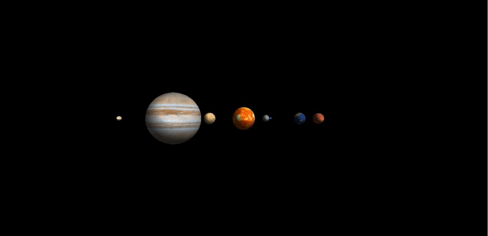

# opengl-solar-system
3d OpenGl/c solar system

## Demo
### Video: https://www.youtube.com/watch?v=VfNcUUI9IiY

### Prints
  
  
## Run
Clone this project, then enter that folder and run:
```sh
./play
```
## Instructions
```sh
p - Pause
l - Enable/disable light
1 - Cam mode 1
2 - Cam mode 2
w/s/a/d - Move cam
Bonus: Mouse click and drag
```


# Edit and compile the game:
## Dependencies
```sh
sudo apt-get install freeglut3-dev 
sudo apt-get install libglew-dev 
sudo apt-get install libsoil-dev 
```
gcc is also needed
## Run
```sh
gcc main.c planetas/*.c -lGL -lGLU -lglut -lGLEW -lSOIL -lm
./a.out
```

# Images
https://www.solarsystemscope.com/textures/
